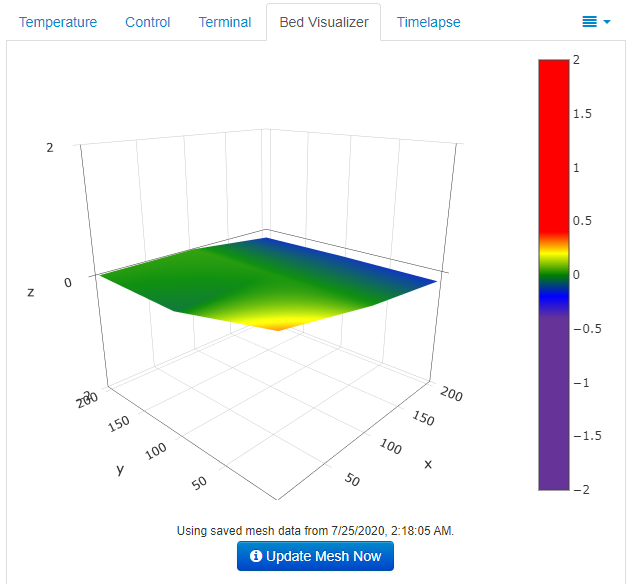
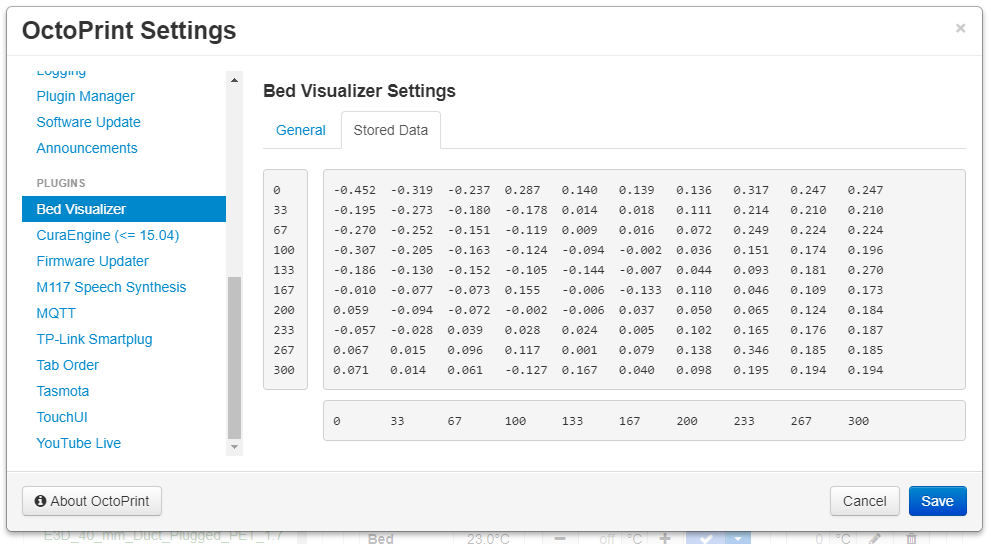

# OctoPrint-BedLevelVisualizer

This plugin utilizes [Plotly](https://plot.ly/plotly-js-scientific-d3-charting-library/) js library to render a 3D surface of the bed's reported mesh on a tab within OctoPrint. It converts this

```
Send: G29 T
Recv: echo:Home XYZ first
Recv: 
Recv: Bed Topography Report:
Recv: 
Recv: (0,9)                                                                   (9,9)
Recv: (30,270)                                                                (270,270)
Recv:  -0.452   -0.319   -0.237    0.287    0.140    0.139    0.136    0.317    0.247    0.247
Recv: 
Recv:  -0.195   -0.273   -0.180   -0.178    0.014    0.018    0.111    0.214    0.210    0.210
Recv: 
Recv:  -0.270   -0.252   -0.151   -0.119    0.009    0.016    0.072    0.249    0.224    0.224
Recv: 
Recv:  -0.307   -0.205   -0.163   -0.124   -0.094   -0.002    0.036    0.151    0.174    0.196
Recv: 
Recv:  -0.186   -0.130   -0.152   -0.105   -0.144   -0.007    0.044    0.093    0.181    0.270
Recv: 
Recv:  -0.010   -0.077   -0.073    0.155   -0.006   -0.133    0.110    0.046    0.109    0.173
Recv: 
Recv:   0.059   -0.094   -0.072   -0.002   -0.006    0.037    0.050    0.065    0.124    0.184
Recv: 
Recv:  -0.057   -0.028    0.039    0.028    0.024    0.005    0.102    0.165    0.176    0.187
Recv: 
Recv:   0.067    0.015    0.096    0.117    0.001    0.079    0.138    0.346    0.185    0.185
Recv: 
Recv: [ 0.071]   0.014    0.061   -0.127    0.167    0.040    0.098    0.195    0.194    0.194
Recv: (30,30)                                                                    (270,30)
Recv: (0,0)                                                                     (9,0)
Recv: ok P15 B3
```
into this



## Known Issues
  - Since version 0.1.3 there is a python dependency on numpy.  As a result; if you don't already have numpy the install can take in excess of 30 minutes to complete on a pi. Just be patient and let it run and eventually the plugin install will finish.
  - If your device have less than 512MB of ram your numpy installation would most likely fail. See #141 for solution.
  - If you have Marlin's Auto Temperature Reporting Feature enabled you will want to have M155 S30 and M155 S3 surrounding your G29 command, see settings screenshot, otherwise the collected data will be tainted.
  - ~~Currently there is a conflict with the TempsGraph plugin.  If you have this plugin installed you will receive an error that Plotyle.react is not a function.  There is a version update pending on that plugin to resolve this issue, just waiting on the author to release.~~ Resolved with TempsGraph release [0.3.3](https://github.com/1r0b1n0/OctoPrint-Tempsgraph/releases/tag/0.3.3).

## Settings




## Tips
  - If your leveling method requires homing first make sure to enter that as well in the GCODE Commands setting.
  - If you have Marlin's Auto Temperature Reporting feature enabled you will want to have M155 S30 and M155 S3 surrounding your reporting GCODE command, otherwise the collected data will be tainted with temperature information.
  - If you end up requiring multiple commands it is recommended to enter `@BEDLEVELVISUALIZER` just prior to the reporting command.

    ~~~
	G28	
    M155 S30	
    @BEDLEVELVISUALIZER	
    G29 T	
    M155 S3
	~~~
	
	Use the following command for Klipper (per https://github.com/jneilliii/OctoPrint-BedLevelVisualizer/issues/92):
	~~~
	@BEDLEVELVISUALIZER
	BED_MESH_OUTPUT
	~~~

## Setup

Install via the bundled [Plugin Manager](https://github.com/foosel/OctoPrint/wiki/Plugin:-Plugin-Manager)
or manually using this URL:

    https://github.com/jneilliii/OctoPrint-BedLevelVisualizer/archive/master.zip

## Changelog

**[0.1.13]** (03/28/2020)
**Added**
- Screw adjustment angle calculations in degrees based on screw size

**Updated**
- Default timeout value increased to 30 minutes to hopefully resolve confusion
- Timeout notification to hopefully make it more clear what needs to be fixed

**Fixed**
- New webcam feature consuming network bandiwdth while idle or not visible

**Thanks**
Thanks to [@LMS0815](https://github.com/LMS0815) for screw adjustment angle changes mentioned above

**[0.1.12]** (03/15/2019)
**Added**
- Rotation options to mesh visualization, community forum request.
- Custom debug logging for future troubleshooting
- Custom commands that will give additional buttons on tab
- Cancel button to stop processing when visualization gets stuck
- Larger precision number processing
- Themify support, will now color the background and axis based on tab colors
- Marlin Mesh Bed Leveling support
- Marlin OpenScad Output support
- Option to show webcam while processing

**Updated**
- Several UI improvements
- Timeout logic to also stop processing on server side
- Plotly library to version 1.52.2 

**[0.1.11]** (10/06/2019)

**Added**
- Python 3 compatibility.

**[0.1.10]** (08/22/2019)

**Added**
- Option for ignoring Bed Level Correction Matrix.

**[0.1.9]** (06/15/2019)

**Fixed**
- Issue where ABL_BILINEAR_SUBDIVISION in Marlin was not graphing correctly.  Now the mesh will be reset to an empty set if the phrase `Subdivided with CATMULL ROM Leveling Grid:` is received and continue mesh collection of points.


**[0.1.8]** (05/26/2019)

**Added**
- Add grid boundary detection and auto flipping for UBL reports, possibly others, for more accurately defined probing points and bed orientation.

**Fixed**
- Fix minor bug where lines w/ `1 |[+0.019] -0.137` are not matched.

**Thanks**
- Thanks to [@gandy92](https://github.com/gandy92) for the above changes.

**[0.1.7]** (11/24/2018)

**Added**
  - New timeout setting that will unlock `processing` UI after given seconds.  If processing takes longer to complete due to full probing requirements or some other reason set this to a higher value.
  - Toggle button in toolbar to enable click events on surface to move the hot end to that position.

**[0.1.6]** (09/06/2018)

**Added**
  - Repetier firmware support thanks to @gztproject.

**[0.1.5]** (09/03/2018)

**Added**
  - Option to make center of bed the origin point per request.  Helpful when using a fixed center leveling system as described [here](https://github.com/PrusaOwners/prusaowners/wiki/Bed_Leveling_without_Wave_Springs).
  - Option to make measured offsets relative to origin position, related to above addition but could be useful elsewhere.
  
**Changed**
  - X/Y axis calculations to resolve bug discovered during above changes where if your leveling grid was based on an odd number of probe points the maximum perimeters were getting dropped due to rounding errors.
  
**[0.1.4]** (08/06/2018)

**Fixed**
  - Issue introduced with previous update that was causing some leveling reports to not be identified correctly.

**[0.1.3]** (08/05/2018)

**Added**
  - Recognition of older bed reports to work for some users.  Should now work with reports that return lines like `Bed x: 40.00 y: 20.00 z: 7.31`.

**[0.1.2]** (06/09/2018)

**Added**
  - Display of last mesh timestamp above Update button.

**[0.1.1]** (06/01/2018)

**Changed**
  - Mobile detection in plotly js library to also detect iPad as webgl device.

**[0.1.0]** (05/02/2018)

**Added**
  - Flip X/Y settings added to allow changing the orientation of the surface displayed.
  - Added Remove Row Labels in order to shift the mesh data to account for some reports that return an index at the beginning of the line.
  - Added bootstrap tooltips to info icons.
  - Wizard added on install to explain/enter the GCODE commands and demonstrate how to use the `@BEDLEVELVISUALIZER` command.

**Changed**
  - Improved graph display by reading build volume from printer profile settings.
  - Fixed Z range on graph between -2mm and 2mm.
  - Updated settings dialog for new options and moved stored data to it's own tab.
  - Simiplified data extraction regular expression.
  - Data collection now triggered based on sending the GCODE command `@BEDLEVELVISUALIZER`.
  
**Removed**
  - Prusa Firmware mode no longer necessary due to added options listed above.

**0.0.9** (skipped)

**[0.0.8]** (04/22/2018)

**Added**
  - Pop-up notification on error.

**Changed**
  - Removed placeholder attribute on  Data Collector Flag to make it more obvious there's nothing typed in it.

**Fixed**
  - Delta printers not collecting mesh data points.

**[0.0.7]** (04/20/218)

**Changed**
  - Description in Plugin Manager.

**[0.0.6]** (04/19/2018)

**Added**
  - Timestamp stored with saved mesh data.  Displays on mouse hover of info graphic on update button.
  
**Changed**
  - Screenshots updated to make settings a little clearer.
  - Visibility bindings fixed for issues related to new installs and no stored data.

**[0.0.5]** (04/18/2018)

**Added**
  - Prusa Firmware Mode setting, to handle G81 responses correctly

**Changed**
  - Graph is now always visible in OctoPrint as long as you have saving enabled, there is a mesh stored, and the user is logged in.

**Fixed**
  - Remove duplicated tabs from Prusa firmware's G81 response.

**[0.0.4]** (04/17/2018)

**Changed**
  - "Data Collector Flag" is now a text field in lieu of select list to allow full customization of the text that flags for mesh data collection to handle the numerous available options that apparently seem to be out there.

**[0.0.3]** (04/17/2018)

**Added**
  - Capture data option for identifying correct response to start storing mesh data
  - Stored data displayed in settings
  - Non-UBL support

**[0.0.2]** (04/15/2018)

**Added**
  - Settings dialog to update the GCODE command used to report bed topology.
  - Improved performance with option for storing the mesh in config.yaml (default).

**Fixed**
  - Reversed point order to fix graphing misorientation.
	
**[0.0.1]** (04/14/2018)

**Initial Release**

[0.1.13]: https://github.com/jneilliii/OctoPrint-BedLevelVisualizer/archive/0.1.13.zip
[0.1.12]: https://github.com/jneilliii/OctoPrint-BedLevelVisualizer/archive/0.1.12.zip
[0.1.11]: https://github.com/jneilliii/OctoPrint-BedLevelVisualizer/archive/0.1.11.zip
[0.1.10]: https://github.com/jneilliii/OctoPrint-BedLevelVisualizer/archive/0.1.10.zip
[0.1.9]: https://github.com/jneilliii/OctoPrint-BedLevelVisualizer/archive/0.1.9.zip
[0.1.8]: https://github.com/jneilliii/OctoPrint-BedLevelVisualizer/archive/0.1.8.zip
[0.1.7]: https://github.com/jneilliii/OctoPrint-BedLevelVisualizer/archive/0.1.7.zip
[0.1.6]: https://github.com/jneilliii/OctoPrint-BedLevelVisualizer/archive/0.1.6.zip
[0.1.5]: https://github.com/jneilliii/OctoPrint-BedLevelVisualizer/archive/0.1.5.zip
[0.1.4]: https://github.com/jneilliii/OctoPrint-BedLevelVisualizer/archive/0.1.4.zip
[0.1.3]: https://github.com/jneilliii/OctoPrint-BedLevelVisualizer/archive/0.1.3.zip
[0.1.2]: https://github.com/jneilliii/OctoPrint-BedLevelVisualizer/archive/0.1.2.zip
[0.1.1]: https://github.com/jneilliii/OctoPrint-BedLevelVisualizer/archive/0.1.1.zip
[0.1.0]: https://github.com/jneilliii/OctoPrint-BedLevelVisualizer/archive/0.1.0.zip
[0.0.9]: https://github.com/jneilliii/OctoPrint-BedLevelVisualizer/archive/0.0.9.zip
[0.0.8]: https://github.com/jneilliii/OctoPrint-BedLevelVisualizer/archive/0.0.8.zip
[0.0.7]: https://github.com/jneilliii/OctoPrint-BedLevelVisualizer/archive/0.0.7.zip
[0.0.6]: https://github.com/jneilliii/OctoPrint-BedLevelVisualizer/archive/0.0.6.zip
[0.0.5]: https://github.com/jneilliii/OctoPrint-BedLevelVisualizer/archive/0.0.5.zip
[0.0.4]: https://github.com/jneilliii/OctoPrint-BedLevelVisualizer/archive/0.0.4.zip
[0.0.3]: https://github.com/jneilliii/OctoPrint-BedLevelVisualizer/archive/0.0.3.zip
[0.0.2]: https://github.com/jneilliii/OctoPrint-BedLevelVisualizer/archive/0.0.2.zip
[0.0.1]: https://github.com/jneilliii/OctoPrint-BedLevelVisualizer/archive/0.0.1.zip

## To-Do
- [ ] Pause standard OctoPrint temperature polling or squash the responses until processing is completed.
- [X] ~~Orientation testing to verify axes are in correct direction.~~ added settings to allow controlling the orientation.
- [X] ~~Calculate bed dimensions and apply to probe points for display on graph, #28.~~

## Support My Efforts
I, jneilliii, programmed this plugin for fun and do my best effort to support those that have issues with it, please return the favor and leave me a tip if you find this plugin helpful.

[](https://paypal.me/jneilliii)

<small>No paypal.me? Send funds via PayPal to jneilliii&#64;gmail&#46;com</small>
